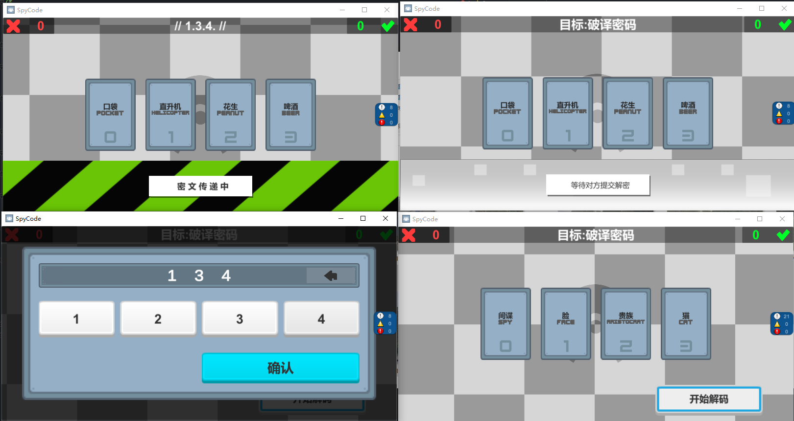

# GamePlay-Introduction  
This is a rudimentary recreation of the board game "Decrypto".   
There is no tutorial, and due to the poorly written code (lack of experience in network architecture), it resulted in poor scalability. Additionally, I did not master the corresponding debugging techniques, so I have decided to stop further development at this point.  

In the previous field, enter the player's name, and in the next field, enter a personal signature. These will be displayed in the room UI. The game will begin once both teams have two players each and are ready.   
During the word selection phase, words can be freely changed. After everyone confirms, the standard "Code Breaker" game process will begin. I apologize that I did not create a results screen either.  
# ScreenShot  
## Title
  

## Match Room
Match in room  
  
Ready  

## InGame  
Select Team Words  
    

StartGame  
  
  
  
  
